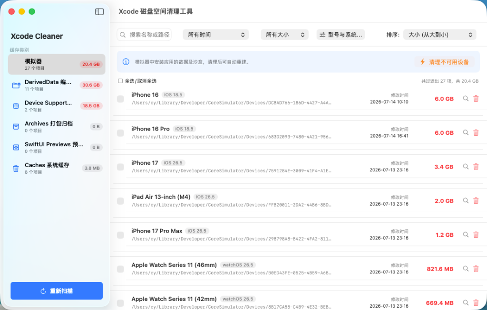

# XcodeCleaner

[简体中文](README.md) | [English](README_en.md)

XcodeCleaner 是一个原生、极轻量、免沙盒限制的 macOS 桌面清理工具，专门用于清理 Xcode 缓存（DerivedData、Archives、DeviceSupport、SwiftUI Previews、Caches 等）以及进行深度模拟器数据过滤清理。

该项目完全基于 **SwiftUI** 构建。为了极致的权限体验并绕过苹果沙盒（Sandbox）对系统目录的拦截，它采用**单文件 Swift GUI 编译设计**。不需要下载臃肿的 `.xcodeproj`，一行指令即可快速在本地编译并拉起原生 GUI 应用。



---

## 🤖 AI Agent 一键部署提示词 (Prompt for AI Agent)

如果您正在使用 **Cursor、GitHub Copilot、Gemini 或者是 Claude** 等 AI 编程助手，可以直接复制以下提示词发给它，AI 会自动为您完成下载、编译并拉起软件：

```text
我需要使用开源的 XcodeCleaner 磁盘清理工具。请帮我在我的 Mac 本地执行以下操作：
1. 在桌面 (Desktop) 上创建一个名为 XcodeCleaner 的文件夹。
2. 通过 curl 下载 GitHub 上的最新源码：
   curl -fsSL https://raw.githubusercontent.com/chenhuaizhe/XcodeCleaner/main/xcode_cleaner.swift -o ~/Desktop/XcodeCleaner/xcode_cleaner.swift
3. 同样下载安装脚本：
   curl -fsSL https://raw.githubusercontent.com/chenhuaizhe/XcodeCleaner/main/install.sh -o ~/Desktop/XcodeCleaner/install.sh
4. 为安装脚本赋予执行权限 chmod +x install.sh，并运行该脚本进行一键编译与全局配置。
5. 成功后，自动在后台帮我拉起运行编译生成的软件。
```

---

## 🚀 快速开始与一键安装 (Quick Start)

在终端运行以下一行指令，自动在当前目录下载、编译并全局链接：

```bash
curl -fsSL https://raw.githubusercontent.com/chenhuaizhe/XcodeCleaner/main/install.sh | bash
```

---

## 🖥 以后如何找到并运行该软件？

安装脚本执行成功后，您可以选择以下任何一种方式随时运行 XcodeCleaner：

1. **Spotlight / 启动台 (推荐)**：  
   直接在您的 Mac 上按 `⌘ + 空格键` 唤出 Spotlight（聚焦搜索），输入 `XcodeCleaner` 回车，即可像启动微信或 Xcode 一样直接拉起它。
2. **终端全局调用**：  
   在终端的任何路径下直接输入 `xcodeclean` 回车即可启动：
   ```bash
   xcodeclean
   ```
3. **访达双击**：  
   在 Finder 中找到可执行二进制文件 `XcodeCleaner` 直接双击启动。

---

## ✨ 核心特性

* **多维度复合过滤**：支持按修改时间（超过30天/90天未修改）、缓存大小（大于100MB/500MB/1G/5G）进行细粒度筛选。
* **模拟器高阶筛选**：
  * **型号分类**：自动解析并归类 `iPhone`、`iPad`、`Apple Watch` 等型号，支持多选。
  * **系统版本**：按 `iOS`、`watchOS` 等系统版本多选过滤。
  * **可用性状态**：一键筛选出由于 Xcode 升级导致不再可用的失效模拟器（Unavailable）。
* **底层 `simctl` 卸载 API**：删除模拟器时，优先调用 `xcrun simctl delete` 彻底干净地注销该设备，防止硬删产生脏数据。
* **自适应多语言**：界面支持中/英文自适应（根据 macOS 系统的 Preferred Languages 自动切换）。
* **零外部依赖**：单个 Swift 源文件搞定全部 UI 和业务逻辑，完全透明，安全可靠。

---

## 📄 开源协议

本项目基于 [MIT License](LICENSE) 协议开源。
