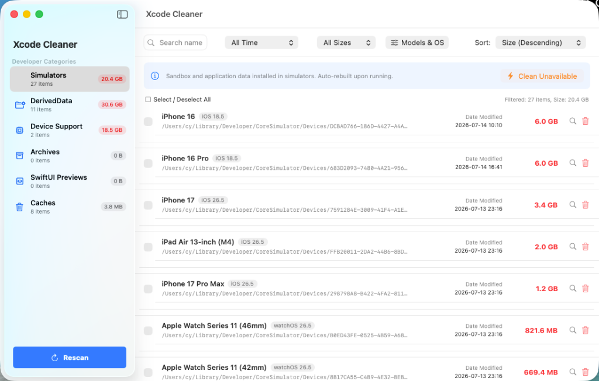

# XcodeCleaner

[简体中文](README.md) | [English](README_en.md)

XcodeCleaner is a native, ultra-lightweight, sandbox-free macOS desktop utility for analyzing and cleaning up Xcode caches (DerivedData, Archives, iOS DeviceSupport, SwiftUI Previews, Caches) and advanced Simulator filtering/deletion.

Built entirely with **SwiftUI** in a **single-file Swift GUI compiler approach**, it bypasses Apple Sandbox's system directory restrictions. It allows you to build and run the native GUI application locally with a single terminal command without setting up bulky `.xcodeproj` project trees.



---

## 🤖 Prompt for AI Agent Deployment

If you are using AI Coding assistants like **Cursor, GitHub Copilot, Gemini, or Claude**, you can copy the following prompt and send it. The AI will download, compile, and launch XcodeCleaner automatically for you:

```text
I want to use the open-source XcodeCleaner disk cleanup utility. Please execute the following locally on my Mac:
1. Create a directory named XcodeCleaner on my Desktop.
2. Download the latest Swift source file using curl:
   curl -fsSL https://raw.githubusercontent.com/chenhuaizhe/XcodeCleaner/main/xcode_cleaner.swift -o ~/Desktop/XcodeCleaner/xcode_cleaner.swift
3. Download the installation script:
   curl -fsSL https://raw.githubusercontent.com/chenhuaizhe/XcodeCleaner/main/install.sh -o ~/Desktop/XcodeCleaner/install.sh
4. Grant execution permission (chmod +x install.sh) and run the installer.
5. Once completed successfully, run the compiled XcodeCleaner binary in the background.
```

---

## 🚀 Quick Start / One-Click Installation

Run this single line command in your terminal to automatically download, compile, and globally link the tool:

```bash
curl -fsSL https://raw.githubusercontent.com/chenhuaizhe/XcodeCleaner/main/install.sh | bash
```

---

## 🖥 How to Find and Run It Daily?

After running the install script, you can launch XcodeCleaner in any of the following ways:

1. **Spotlight / Launchpad (Recommended)**:  
   Press `⌘ + Space` to open Spotlight, type `XcodeCleaner`, and press enter to launch it like a standard Mac app.
2. **Terminal Command Line**:  
   Run `xcodeclean` from any directory in your terminal:
   ```bash
   xcodeclean
   ```
3. **Applications Folder**:  
   Double-click the `XcodeCleaner.app` bundle (packaged with a premium 3D hammer icon) inside your Applications folder.

---

## ✨ Features

* **Fine-Grained Filtering**: Filter directories by idle time (e.g. older than 30 or 90 days) and file sizes (> 100M/500M/1G/5G).
* **Advanced Simulator Sorting**:
  * **Device Model**: Groups simulators by `iPhone`, `iPad`, `Apple Watch`, etc., supporting multi-selection.
  * **OS Version**: Filter simulators by system runtime runtimes (e.g., `iOS 18.0`, `watchOS 11.2`), supporting multi-selection.
  * **Availability status**: Instantly display and delete unavailable (corrupted/outdated) simulator profiles.
* **Safe `simctl` API Deletion**: Uses Apple's official `xcrun simctl delete` API to remove simulators gracefully, avoiding database inconsistencies from direct filesystem deletion.
* **Locale-Adaptive UI**: The GUI automatically toggles between Chinese (Simplified) and English depending on the macOS System preferred language list.
* **Zero Dependencies**: Entire UI and business logic are stored in a single source file, with no external package requirements. 100% transparent and safe.

---

## 📄 License

This project is licensed under the [MIT License](LICENSE).
